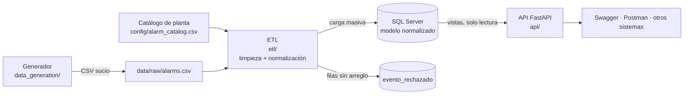
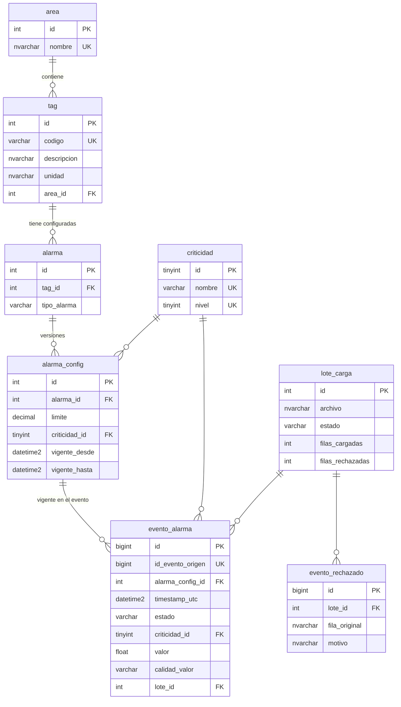

# SCADA Alarm Gateway & Migrator

Solución que toma el histórico de alarmas de un SCADA legacy (CSV con problemas de
calidad de datos), lo limpia y normaliza, lo centraliza en **SQL Server** y lo expone
mediante una **API REST en FastAPI** para que otros sistemas de la planta consulten
alarmas y métricas.



## Contenido

1. [Entregables](#entregables)
2. [Ejecución](#ejecución)
3. [Probar la API](#probar-la-api)
4. [Descripción de la solución](#descripción-de-la-solución)
   - [Dataset](#1-dataset)
   - [Ingesta, limpieza y normalización](#2-ingesta-limpieza-y-normalización)
   - [Modelo de datos](#3-modelo-de-datos)
   - [API](#4-api)
5. [Justificación de decisiones técnicas](#justificación-de-decisiones-técnicas)
6. [Escalabilidad](#escalabilidad)
7. [Pruebas](#pruebas)
8. [Limitaciones y trabajo futuro](#limitaciones-y-trabajo-futuro)

---

## Entregables

| Entregable | Dónde |
|---|---|
| Dataset de alarmas con problemas de calidad intencionales | [`data_generation/generate_dataset.py`](data_generation/generate_dataset.py) → [`data/raw/alarms.csv`](data/raw/alarms.csv) · diccionario en [`docs/dataset.md`](docs/dataset.md) |
| Ingesta, limpieza y normalización | [`etl/`](etl/) |
| Modelo relacional (SQL Server) | [`sql/01_schema.sql`](sql/01_schema.sql) |
| API en Python (FastAPI) | [`api/`](api/) |
| Colección de Postman | [`postman/alarmas.postman_collection.json`](postman/alarmas.postman_collection.json) |
| Pruebas (150 unitarias) | [`tests/`](tests/) |
| Entorno reproducible | [`docker-compose.yml`](docker-compose.yml), [`Dockerfile`](Dockerfile) |

```
├── data_generation/   generador del dataset sintético
├── data/raw/          CSV legacy generado (fuente de la ingesta)
├── config/            catálogo de instrumentos y alarmas de la planta
├── etl/               lectura, limpieza, normalización y carga masiva
├── sql/               creación de la base de datos y del esquema
├── api/               API REST (routers → schemas → repository)
├── tests/             pruebas del ETL y de la API
├── postman/           colección de Postman
└── docs/              diccionario de datos del dataset
```

---

## Ejecución

### Opción A: Docker (recomendada)

Requisito: [Docker Desktop](https://www.docker.com/products/docker-desktop/) abierto y en ejecución.

1. Crear el archivo de configuración a partir del ejemplo:

   ```bash
   cp .env.example .env
   ```

   (En PowerShell: `Copy-Item .env.example .env`)

2. Levantar todo:

   ```bash
   docker compose up -d --build
   ```

   Esto levanta tres servicios en orden:

   | Servicio | Qué hace |
   |---|---|
   | `db` | SQL Server 2022 (edición Developer) |
   | `etl` | Crea la base, el esquema y el usuario de solo lectura; limpia y carga el CSV; termina |
   | `api` | Arranca cuando el ETL terminó bien, en http://localhost:8000 |

   La primera vez descarga la imagen de SQL Server (~1,5 GB) y tarda unos minutos.

3. Comprobar que todo está listo (`api` debe aparecer como `healthy`):

   ```bash
   docker compose ps
   ```

4. Ver el resultado de la carga:

   ```bash
   docker compose logs etl
   ```

   ```
   Filas leídas:        22421
   Duplicadas:          415
   Válidas:             21443
   Rechazadas:          563
   Lote 1: 21443 eventos cargados, 0 ya existían en la BD
   ```

Para apagar: `docker compose down` (conserva los datos) o `docker compose down -v` (borra la base).

> Levantar la solución acepta las licencias de Microsoft de SQL Server Developer y del
> driver ODBC 18 (`ACCEPT_EULA=Y` en `docker-compose.yml` y `Dockerfile`).

### Opción B: sin Docker

Requisitos: Python 3.12+, un SQL Server accesible y el
[Microsoft ODBC Driver 18 for SQL Server](https://learn.microsoft.com/sql/connect/odbc/download-odbc-driver-for-sql-server).

```bash
python -m venv .venv
.venv/Scripts/activate            # Linux/macOS: source .venv/bin/activate
pip install -r requirements-dev.txt
cp .env.example .env              # ajustar DB_HOST y contraseñas
python -m etl init-db             # crea la BD, el esquema y el usuario de la API
python -m etl load                # limpia y carga data/raw/alarms.csv
uvicorn api.main:app --reload     # API en http://localhost:8000
```

### Otros comandos útiles

| Comando | Para qué |
|---|---|
| `python -m etl validate --rejected-output data/rejected/rejected.csv` | Limpiar el CSV y ver el reporte de calidad **sin base de datos** |
| `python data_generation/generate_dataset.py --alarms 8000 --seed 42` | Regenerar el dataset (misma semilla = mismo archivo) |
| `python -m pytest` | Ejecutar las pruebas (no necesitan base de datos) |

---

## Probar la API

Todos los endpoints de `/api/v1` requieren el header `X-API-Key` (valor de `API_KEY`
en `.env`; por defecto `dev-api-key-cambiar`).

- **Swagger UI**: http://localhost:8000/docs → botón **Authorize** → ingresar la clave →
  en cada endpoint **Try it out** → **Execute**. FastAPI genera esta documentación
  automáticamente a partir del código.
- **Postman**: importar [`postman/alarmas.postman_collection.json`](postman/alarmas.postman_collection.json)
  y ejecutarla con **Run**. Trae 22 peticiones (casos de éxito y de error), cada una con tests.
- **Terminal** (en PowerShell usar `curl.exe`):

  ```bash
  curl -H "X-API-Key: dev-api-key-cambiar" "http://localhost:8000/api/v1/alarmas?tag=PT-101&criticidad_min=HIGH&desde=2026-07-01&hasta=2026-07-08&size=2"
  ```

  ```bash
  curl -H "X-API-Key: dev-api-key-cambiar" "http://localhost:8000/api/v1/metricas/top-tags?limit=5"
  ```

Los datos cubren del **2 de julio al 30 de septiembre de 2026**.

---

## Descripción de la solución

### 1. Dataset

[`generate_dataset.py`](data_generation/generate_dataset.py) simula la exportación del
*alarm journal* de un SCADA legacy: **8 000 alarmas en 90 días → 22 421 filas** en
[`data/raw/alarms.csv`](data/raw/alarms.csv). Es reproducible (`--seed`) y solo usa la
librería estándar de Python.

**Cada fila es un evento, no una alarma.** Según ISA-18.2 / IEC 62682, una alarma tiene
un ciclo de vida:

```
ACTIVE (la variable cruza el límite) ──► ACK (el operador la reconoce) ──► RTN (vuelve a normal)
```

Por eso una alarma genera de 1 a 3 filas.

| Columna | Significado |
|---|---|
| `id_evento` | Id del evento en el SCADA |
| `timestamp` | Momento del evento |
| `tag` | Instrumento, nomenclatura ISA (`PT-101` = transmisor de presión 101) |
| `descripcion`, `area` | Descripción y área de planta del instrumento |
| `tipo_alarma` | Condición: `HI`, `HIHI`, `LO`, `LOLO`, `DEV`, `ROC`, `DISC` |
| `criticidad` | Prioridad (4 niveles, ISA-18.2): `CRITICAL`, `HIGH`, `MEDIUM`, `LOW` |
| `estado` | Transición del ciclo de vida: `ACTIVE`, `ACK`, `RTN` |
| `valor` | Lectura del sensor en el evento |
| `limite`, `unidad` | Límite configurado y unidad de ingeniería |

**Problemas de calidad inyectados intencionalmente:**

| Problema | Ejemplos | Filas aprox. |
|---|---|---|
| Fechas en 8 formatos distintos y zonas horarias mezcladas | `2026-07-02T00:12:14Z`, `01/07/2026 19:01:13`, `07-01-2026 07:11:05 PM`, `2026-07-01T20:02:24.408-05:00`, epoch en s y ms, `20260702T010413Z` | 7 600 |
| Fechas imposibles o vacías | `N/A`, `31/02/2026 10:00:00`, `0000-00-00 00:00:00`, `##########` | 460 |
| Criticidad con sinónimos o vacía | `Alta`, `P1`, `3`, `crit`, `Urgent`, vacío | 6 000 |
| Estado con sinónimos | `ACT`, `ALM`, `ACKED`, `Cleared`, `OK` | 4 400 |
| Tags sucios o vacíos | `tt 301`, ` PT-101 `, `PT_101`, `PT101` | 2 300 |
| Valores con tipado irregular o vacíos | `85,30` (coma decimal), `2.442e+01`, `6.960000  `, `Bad Quality`, `NaN`, `COMM FAIL`, vacío | 3 000 |
| Área nula | vacío, `NULL`, `null`, `-` | 1 100 |
| Duplicados exactos (el SCADA reenvía eventos) | mismo `id_evento` | 415 |
| BOM UTF-8 al inicio del archivo | típico de exportaciones Windows | 1 |

**Supuestos del dataset:**

- **No existe un formato estándar de exportación de alarmas.** Las columnas son el
  denominador común de los *alarm journals* de SCADA comerciales (AVEVA/Wonderware,
  Ignition, WinCC) y del modelo de ciclo de vida de ISA-18.2. Los filtros que exige la API
  (tiempo, criticidad, tag) definieron las columnas obligatorias.
- **Zona horaria**: la planta opera en UTC-5. Los formatos que vienen de la HMI local
  (`dd/mm/yyyy` y `mm-dd-yyyy hh:mm:ss AM/PM`) están en hora local; los que empiezan
  por el año, los epoch y los que llevan `Z` u offset, en UTC o con zona explícita.
- **Día/mes**: se distinguen por el separador (`/` = día primero, `-` = estilo US). En un
  proyecto real esto se confirmaría con el cliente para cada fuente.
- **Distribución realista**: pocos tags *bad actors* (PT-101, FT-201, VT-401) concentran
  la mayoría de las alarmas, como describe ISA-18.2. Así el ranking de top tags es significativo.
- **Comportamiento del operador**: las alarmas CRITICAL se reconocen casi siempre y rápido;
  la mitad de las LOW nunca se reconoce (refleja *alarm floods*). El 5 % de las alarmas sigue
  activa al final del periodo (sin RTN).
- Los límites de alarma no cambian durante el periodo simulado, pero el modelo de datos
  soporta que cambien (ver [modelo](#3-modelo-de-datos)).

El detalle completo está en [`docs/dataset.md`](docs/dataset.md).

### 2. Ingesta, limpieza y normalización

```
leer CSV ─► deduplicar ─► normalizar cada columna ─► validar contra el catálogo ─► separar
(todo como texto)          (funciones puras)                                       │
                                                         válidas ───► staging ───► INSERT…SELECT
                                                         rechazadas ─► evento_rechazado (con motivo)
```

| Módulo | Responsabilidad |
|---|---|
| [`normalizers.py`](etl/normalizers.py) | Una función pura por columna: recibe texto crudo y devuelve el valor canónico o un motivo de rechazo |
| [`catalog.py`](etl/catalog.py) | Catálogo de la planta (tags, unidades, límites) con versiones de vigencia |
| [`pipeline.py`](etl/pipeline.py) | Aplica los normalizadores, decide qué se carga y qué se rechaza, y produce estadísticas de calidad. No conoce la BD |
| [`loader.py`](etl/loader.py) | Carga masiva en SQL Server, sincronización del catálogo y trazabilidad por lote |

**Reglas de limpieza:**

| Dato | Regla | Si no se puede arreglar |
|---|---|---|
| `timestamp` | Lista explícita de formatos (sin adivinar); epoch por cantidad de dígitos; hora local → UTC; se rechazan fechas futuras o anteriores al 2000 | Rechazo |
| `tag` | Mayúsculas, sin espacios; `PT_101`, `pt 101`, `PT101` → `PT-101`; debe existir en el catálogo | Rechazo |
| `criticidad` | Diccionario de sinónimos (`Alta`, `P2`, `2` → `HIGH`) | Vacía → se completa con la del catálogo |
| `estado` | Diccionario (`ACT`, `ALM` → `ACTIVE`; `Cleared`, `OK` → `RTN`) | Rechazo |
| `valor` | Coma decimal → punto; notación científica; `Bad Quality`, `NaN`, `#####` → `NULL` con `calidad_valor = 'BAD'` | La fila **no** se rechaza: el evento sigue siendo válido aunque la lectura no lo sea |
| `descripcion`, `area`, `unidad`, `limite` | No se toman del evento: vienen del catálogo. Si el CSV contradice al catálogo se registra un aviso | — |
| Duplicados | Se conserva la primera aparición de cada `id_evento` | — |

**Resultado sobre el dataset:**

| | Filas |
|---|---|
| Leídas | 22 421 |
| Duplicadas (descartadas) | 415 |
| **Cargadas** | **21 443** |
| Rechazadas | 563: 242 fechas inválidas, 220 fechas vacías, 103 tags vacíos (2 filas con dos defectos) |
| Criticidad completada desde el catálogo | 655 |
| Valor marcado `BAD` / sin valor | 690 / 652 |

Nada se pierde en silencio: cada fila rechazada queda en `evento_rechazado` con su
contenido original y el motivo, y cada ejecución queda registrada en `lote_carga`.

**Carga eficiente:**

1. Los eventos limpios se envían en bloque a una tabla temporal con
   `pyodbc.fast_executemany` (miles de filas por viaje al servidor, no una por fila).
2. Un único `INSERT … SELECT` pasa de staging a la tabla final resolviendo en el servidor
   las claves foráneas, incluida la versión de configuración vigente en la fecha de cada evento.
3. **Idempotente**: re-ejecutar el ETL sobre el mismo archivo no duplica datos
   (`UNIQUE (id_evento_origen)`); la segunda ejecución reporta "0 cargados, 21 443 ya existían".
4. El archivo se procesa por bloques (`--chunksize`, 50 000 filas por defecto): la memoria no
   crece con el tamaño del archivo.
5. Cada lote es una transacción: se confirma completo o se revierte, y queda registrado con
   estado `OK` o `ERROR`.

### 3. Modelo de datos

El CSV es plano: cada evento repite la descripción, el área, la unidad y el límite. Esos
datos **no describen al evento, sino al instrumento o a la configuración de la alarma**, así
que se separan (3FN):



| Tabla | Qué guarda |
|---|---|
| `area` | Zonas de la planta |
| `tag` | Instrumentos físicos. **La unidad pertenece al instrumento**: un transmisor de presión mide en bar sin importar cuántas alarmas tenga |
| `criticidad` | Referencia. `nivel` permite filtros ordinales ("HIGH o superior") |
| `alarma` | Qué alarmas existen (tag + tipo). Un tag puede tener varias: PT-101 con HI y HIHI |
| `alarma_config` | **El límite pertenece a la alarma**, y puede cambiar: versiones con vigencia |
| `evento_alarma` | Los hechos: cada transición del ciclo de vida (la tabla grande) |
| `lote_carga`, `evento_rechazado` | Trazabilidad del ETL |

**Límites que cambian (versionado).** En planta los límites se reajustan (racionalización
de alarmas, gestión del cambio de ISA-18.2). Si un límite se sobrescribiera con `UPDATE`, un
evento de marzo (212 °C con límite de 210 °C en ese momento) se compararía con el límite
nuevo de julio (220 °C) y parecería una alarma injustificada. Por eso `alarma_config` guarda
versiones (*Slowly Changing Dimension* tipo 2): cambiar un límite es cerrar la versión
vigente e insertar una nueva, y cada evento apunta a la versión que estaba vigente cuando
ocurrió. El ETL se niega a cargar un catálogo que modifica una versión existente.

**Índices orientados a las consultas de la API:**

| Índice | Consulta que resuelve |
|---|---|
| `CLUSTERED (timestamp_utc, id)` | Rangos de tiempo: las filas de un periodo quedan contiguas en disco. Los eventos llegan en orden cronológico, así que las inserciones van al final sin fragmentar |
| `(criticidad_id, timestamp_utc) INCLUDE (...)` | Criticidad + rango de tiempo |
| `(alarma_config_id, timestamp_utc) INCLUDE (estado)` | Tag + rango de tiempo y ranking de top tags |
| `alarma_config (alarma_id, vigente_desde)` | Resolver la versión vigente durante la carga |

**Desnormalización deliberada:** `criticidad_id` se copia en `evento_alarma` aunque ya está
en `alarma_config`, para que el filtro más común (criticidad + tiempo) use un índice sin JOINs.

**Vistas de consulta:** `v_evento_alarma` reconstruye la vista plana (tag, unidad, límite,
`desviacion_limite`) con JOINs, y `v_catalogo` expone la configuración vigente. La API solo
lee de estas vistas.

### 4. API

```
api/
├── main.py         crea la app, CORS, manejadores de error, monta /api/v1
├── routers/        endpoints (sin SQL)
├── schemas.py      validación de entrada y forma de las respuestas (Pydantic)
├── repository.py   único módulo con SQL
├── db.py           conexión por request (pool de pyodbc)
├── errors.py       formato de error uniforme
├── security.py     API key
└── config.py       configuración por variables de entorno
```

| Método | Ruta | Descripción |
|---|---|---|
| GET | `/health` | Estado de la API y de la base de datos (sin API key) |
| GET | `/api/v1/alarmas` | Eventos con filtros opcionales y combinables, paginados |
| GET | `/api/v1/alarmas/{id}` | Un evento |
| GET | `/api/v1/metricas/top-tags` | Ranking de tags por número de alarmas o de eventos |
| GET | `/api/v1/metricas/por-criticidad` | Alarmas por criticidad |
| GET | `/api/v1/tags` | Catálogo de instrumentos con su configuración vigente |

**Filtros de `/api/v1/alarmas`:**

| Parámetro | Ejemplo | Notas |
|---|---|---|
| `desde`, `hasta` | `2026-07-01`, `2026-07-01T08:00:00-05:00` | ISO 8601. Sin zona = UTC. `desde` incluido, `hasta` excluido |
| `tag` | `PT-101` | Acepta las mismas variantes que limpia el ETL (`pt_101`, `PT101`) |
| `criticidad` | `?criticidad=LOW&criticidad=CRITICAL` | Una o varias exactas |
| `criticidad_min` | `HIGH` | Esa o superior. Excluyente con `criticidad` |
| `estado` | `ACTIVE` | `ACTIVE`, `ACK` o `RTN` |
| `page`, `size` | `1`, `50` | `size` máximo 500 |

`/api/v1/metricas/top-tags` acepta `desde`, `hasta`, `criticidad_min`, `limit` (máx. 50) y
`contar`: `alarmas` (por defecto, cuenta solo `ACTIVE` = veces que saltó la alarma) o
`eventos` (cuenta todas las transiciones). La distinción importa: una alarma genera hasta 3
eventos, y contarlos todos inflaría el ranking.

**Ejemplo de respuesta:**

```json
{
  "items": [
    {
      "id": 1426, "id_evento_origen": 1469, "timestamp_utc": "2026-07-07T23:40:43.866000Z",
      "tag": "PT-101", "descripcion": "Presión descarga bomba P-101", "area": "Bombeo",
      "tipo_alarma": "HI", "criticidad": "HIGH", "estado": "RTN",
      "valor": 5.97, "calidad_valor": "GOOD", "unidad": "bar", "limite": 8.5, "desviacion_limite": -2.53
    }
  ],
  "total": 324, "page": 1, "size": 1, "pages": 324
}
```

**Validación y errores.** Toda la validación vive en `schemas.py`: si un parámetro no es
válido, la API responde antes de tocar la base de datos. Todos los errores tienen la misma forma:

```json
{"error": {"codigo": "VALIDACION", "mensaje": "Parámetros inválidos",
           "detalle": [{"campo": "query", "mensaje": "Value error, 'desde' debe ser anterior a 'hasta'"}]}}
```

| Código | Cuándo |
|---|---|
| 422 `VALIDACION` | Fecha inválida, rango invertido o vacío, criticidad/estado inexistente, tag mal formado, `criticidad` + `criticidad_min` juntos, `page`/`size` fuera de rango, **parámetro desconocido** (`?criticiad=HIGH` no se ignora en silencio) |
| 404 `NO_ENCONTRADO` | Tag o evento inexistente |
| 401 `NO_AUTORIZADO` | API key ausente o incorrecta |
| 405 | Método distinto de GET |
| 503 `BD_NO_DISPONIBLE` | Base de datos caída o inaccesible |
| 500 `ERROR_INTERNO` | Error inesperado (se registra en el log; al cliente no se le exponen detalles) |

**Seguridad:**

- **Usuario de base de datos de solo lectura.** La API se conecta como `api_lectura`, que
  solo tiene `SELECT` sobre las dos vistas. No puede leer tablas ni escribir; el contenedor
  de la API no recibe la contraseña de `sa`.
- **Consultas parametrizadas**: los valores del usuario nunca se concatenan en el SQL.
- **API key** por header `X-API-Key`, comparada en tiempo constante (`secrets.compare_digest`).
- Solo métodos GET; CORS restringido a orígenes configurados; tamaño de página acotado.
- La imagen de Docker corre con un usuario sin privilegios; los secretos van en `.env`, que no se versiona.

---

## Justificación de decisiones técnicas

| Decisión | Por qué | Alternativa descartada |
|---|---|---|
| **Cada fila del dataset es un evento del ciclo de vida** | Así exportan los SCADA reales (ISA-18.2) y permite métricas reales (tiempo de reconocimiento, alarmas sin reconocer), no solo contar filas | Una fila por alarma: más simple, pero irreal |
| **El CSV se mantiene plano; se normaliza en la ingesta** | La fuente es de un sistema legacy que no controlamos. La normalización es responsabilidad del destino | Generar el CSV ya normalizado: haría trivial el problema |
| **Límites y unidades en tablas de catálogo, no en el código** | Los límites cambian en planta; con constantes en código cambiar uno exigiría un redeploy, y los consumidores SQL no los verían. El código guarda la **regla** (HI = valor > límite); la BD guarda el **número** | Constantes en código; o repetir el límite en cada evento como el CSV |
| **Catálogo en un archivo versionado** (`config/alarm_catalog.csv`) | Es la configuración de la planta (el *Master Alarm Database* de ISA-18.2); no se deduce de los eventos, que vienen sucios | Derivarlo del CSV de eventos: heredaría sus errores |
| **Versionado de configuración (SCD tipo 2)** | Interpretar cada evento con el límite vigente cuando ocurrió | `UPDATE` del límite: reinterpreta mal el histórico |
| **Fechas parseadas contra una lista explícita de formatos** | Un parser "inteligente" (`dateutil`) puede confundir día y mes en silencio. Mejor rechazar que cargar una fecha equivocada | `pd.to_datetime` / `dateutil.parser` |
| **Todo el CSV se lee como texto** | Si pandas convirtiera `NULL`, `NaN` o `N/A` en nulos automáticamente, se perdería la diferencia entre "no hay dato" y "el sensor reportó un fallo" | Inferencia de tipos de pandas |
| **Rechazar vs. corregir** | Se corrige lo que tiene una única interpretación (sinónimos, formatos); se rechaza lo que obligaría a inventar datos (fecha `N/A`, tag vacío). Un valor `Bad Quality` no rechaza el evento | Descartar toda fila con cualquier defecto; o rellenar con valores por defecto |
| **Rechazos guardados en tabla, con motivo** | Trazabilidad: alguien puede revisar qué se descartó y por qué | Solo loguearlos |
| **UTC en la base de datos** | Una sola referencia horaria; evita ambigüedades con cambios de hora y entre plantas | Hora local |
| **`valor` como `FLOAT`, `limite` como `DECIMAL`** | Las lecturas del SCADA son de punto flotante por naturaleza; los límites son configuración exacta | Todo `DECIMAL` |
| **SQL Server** | Lo menciona el enunciado y es habitual en entornos industriales (historians, MES) | PostgreSQL, igual de válido |
| **pyodbc con SQL explícito, sin ORM** | Control total del SQL y de los índices que se usan; la carga masiva necesita `fast_executemany` y staging | SQLAlchemy ORM: más abstracción de la necesaria para pocas consultas |
| **Arquitectura en capas en la API** | Cada capa se prueba sola: los tests de la API reemplazan el repositorio por uno falso. Cambiar de BD solo toca `repository.py` | Lógica y SQL dentro de los endpoints |
| **La API lee de vistas** | Desacopla la API del modelo físico y permite dar permisos solo sobre las vistas | Leer tablas directamente |
| **Endpoints `def`, no `async def`** | pyodbc es bloqueante; FastAPI ejecuta los `def` en un pool de hilos y no bloquea el event loop | `async def` con un driver bloqueante (bloquearía todo el servidor) |
| **Tag inexistente → 404, no lista vacía** | En planta, un tag que no existe casi siempre es un error de tipeo; un 200 vacío lo ocultaría | 200 con lista vacía |
| **Parámetros desconocidos → 422** | `?criticiad=HIGH` ignorado devolvería todo sin filtrar, sin que nadie lo note | Ignorarlos (comportamiento por defecto de FastAPI) |
| **Versión en la URL (`/api/v1`)** | Otros sistemas de planta consumirán la API; un cambio incompatible irá a `/api/v2` sin romperlos | Sin versionar |
| **Docker con versiones fijas** (`python:3.12-slim-bookworm`, dependencias con versión exacta) | Reproducibilidad. Con la etiqueta genérica `slim`, la imagen pasó a Debian 13 y el driver ODBC (del repositorio de Debian 12) dejó de cargar | Etiquetas genéricas |

---

## Escalabilidad

Implementado:

- **Carga masiva** por bloques con `fast_executemany` + staging + `INSERT … SELECT`, idempotente y transaccional.
- **Procesamiento por chunks** del archivo: la memoria no depende de su tamaño.
- **Índice clustered por tiempo** e índices compuestos para criticidad y tag, con columnas incluidas para evitar lecturas a la tabla.
- **Paginación** con tamaño máximo y conteo total.
- **Pool de conexiones** en la API.

Siguientes pasos para volúmenes de planta (millones de eventos por año):

- **Paginación por cursor (keyset)** en lugar de `OFFSET`: `WHERE timestamp_utc < @ultimo` mantiene el costo constante en páginas profundas.
- **Particionado de `evento_alarma` por mes**: permite archivar o purgar periodos completos sin `DELETE` masivos.
- **Índice columnstore** para las agregaciones (top tags, conteos), que escanean muchas filas.
- **Vistas indexadas o tablas de resumen** precalculadas por hora/día para métricas de dashboards.
- **Carga incremental** desde el SCADA (por ejemplo, cada 5 minutos) en lugar de archivos completos; el diseño idempotente ya lo permite.
- **`BULK INSERT` / `bcp`** para archivos de varios GB.
- **Varias réplicas de la API** detrás de un balanceador (es *stateless*) y una réplica de lectura de SQL Server.

---

## Pruebas

```bash
python -m pytest
```

**150 pruebas** que no necesitan base de datos:

| Archivo | Qué prueba |
|---|---|
| [`test_normalizers.py`](tests/test_normalizers.py) | Un caso por cada defecto del dataset: los 8 formatos de fecha (todos deben dar el mismo instante UTC), fechas imposibles, futuras y anteriores a 2000, variantes de tag, sinónimos, coma decimal, notación científica, `Bad Quality`, `NaN`, `inf` |
| [`test_pipeline.py`](tests/test_pipeline.py) | Deduplicación, filas recuperables vs. rechazadas, acumulación de motivos, criticidad inferida del catálogo, tag fuera del catálogo, eventos anteriores a la configuración, incoherencias CSV/catálogo |
| [`test_catalog.py`](tests/test_catalog.py) | Versión vigente según la fecha, catálogo inválido, y que el catálogo coincida con el generador |
| [`test_loader.py`](tests/test_loader.py) | Conversión de nulos de pandas y fechas para el driver |
| [`tests/api/`](tests/api/test_api.py) | API con repositorio falso: cada regla de validación (422), 404, 401, 405, 503 con la BD caída, 500 sin filtrar detalles internos, normalización de filtros y formato de respuesta |

Además, la solución se verificó contra SQL Server en Docker: los totales y rankings de la
API coinciden con consultas directas a la base, el usuario `api_lectura` no puede leer
tablas ni borrar datos, y las 22 peticiones de la colección de Postman devuelven el código esperado.

---

## Limitaciones y trabajo futuro

- **Frontend**: no incluido. La API ya expone lo necesario para un dashboard (listado
  filtrable, `/metricas/top-tags`, `/metricas/por-criticidad`, `/tags`) y tiene CORS configurado.
- **Métricas ISA-18.2 adicionales**: tiempo medio de reconocimiento, alarmas por operador por
  hora, alarmas *chattering* y alarmas permanentes (sin RTN). Los datos ya lo permiten porque
  se conserva el ciclo de vida completo.
- **Fuente JSON**: el ETL lee CSV. Agregar JSON solo requiere otro lector que entregue el mismo
  DataFrame de texto a `pipeline.transform`.
- **Autenticación**: la API key es adecuada para integración entre sistemas; para usuarios
  finales correspondería OAuth2/OIDC con el proveedor de identidad de la planta.
- **Pruebas de integración automatizadas** contra SQL Server (por ejemplo con Testcontainers) en CI.
- **Supuestos a validar con el cliente**: zona horaria de cada fuente, convención día/mes,
  y el catálogo real de instrumentos y límites.
